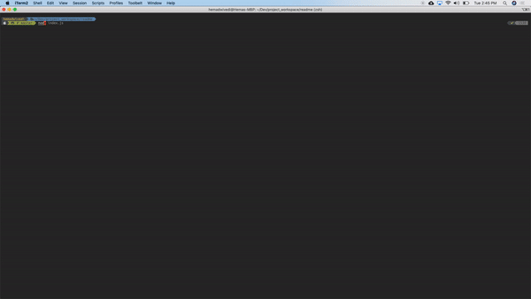

## <%= projectTitle; %> 

<%= description;  %>

## Tables of Contents
- [Installation](#installation)
- [Usage](#usage)
- [Demo](#demo)
- [License](#license)
- [Contributing](#contributing)
- [Tests](#tests)
- [Questions](#questions)
- [Credits](#credits)

# Installation
```
 <%= installation; %>
```
# Usage
```
 <%= usage; %>
```
# Demo


# License
<%= license; %>
# Contributing
<%= contribute; %>
# Tests
<%= tests; %>
# Questions


If you have any questions, please e-mail me at <%= email; %>.

# Credits
Github: [<%= username; %>](<%= githubUrl; %>)
Copyright <%= username; %>. All Rights Reserved.